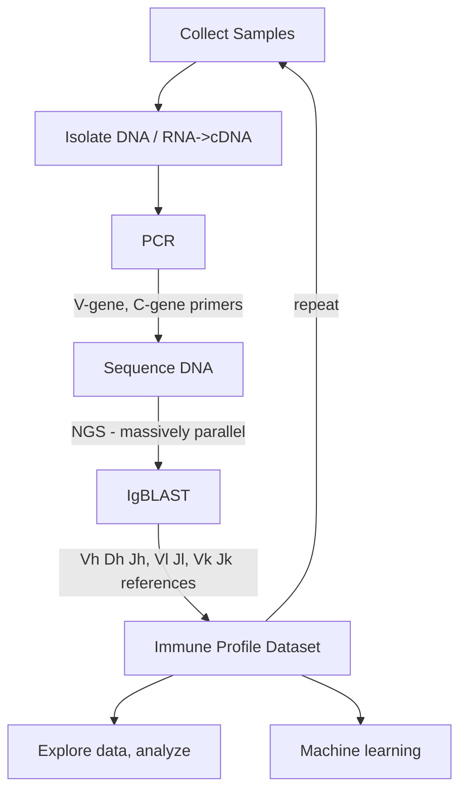

# Classifying Antigen Receptors (Antibodies and T-Cell Receptors) with Immunoprofiling

## Background
Immunoprofiling or immune-profiling is used to assess the diversity of antigen receptors (ARs: antibodies and T-Cell receptors) and how this diversity changes in response to allergens, infections, or vaccines. Understanding AR diversity helps scientists develop new vaccines, improve existing vaccines, and treat allergies and disease. Diversity is assessed by sequencing DNA corresponding to the variable regions of ARs. Learn more about immunoprofiling at https://digitalworldbiology.com/blog/what-immunoprofiling. 

## General Workflow
The common source for antibody seqeunce data comes from immune profiling experiements and assays. 

## Repository Contents
This repository contains the work from a one-week hackathon involving college instructors, high school teachers and students that was focused on leaning immunoprofiling concepts through hands on activities. 

One part of the project utilized precomputed datasets to explore statistical methods that are used in determining AR quality, diversity and clonality, and how clonality is used to understand immune responses in certain cancer. Precomputed datasets are large tables, in [Adaptive Immune Receptor Repertoire(AIRR)](https://docs.airr-community.org/en/stable/) format, that contain sample meta data, v-gene, d-gene, and j-gene annotations/sequences, and note productive and unproductive rearrangments.  

Another part explored bioinformatics workflows needed to prepare AR sequences for statistical analyses. Team members worked with datasets from different databases like [OPIG](https://opig.stats.ox.ac.uk/webapps/covabdab/) and the NCBI short read archive ([example influenza data](https://www.ncbi.nlm.nih.gov/sra/?term=PRJNA349143). A small number of datasets (2 to 4) were prepared and processed with command line tools that include quality filtering, merging forward/reverse reads, sequence alignment via IgBLAST, data parsers, and statistical counting tools.  

## Resources
### Jetstream
The NSF supported Jetstream (https://jetstream-cloud.org/) computing resources supported computation. One 64-core instance was created along with user accounts. See [getting started](/getting-started.md) for 2024 installation and configuration of the computing enviornment based on [lessons learned](#outcomes-and-lessons)(#6).

### Software
Core software tools and languages include:
- [igBLAST](https://ncbi.github.io/igblast/) allows users to view the matches to the germline V, D, J and C genes, details at rearrangement junctions, the delineation of IG V domain framework regions and complementarity determining regions. The package contains the core igblastn and igblastp programs, plus scripts for formating [databases](#reference-data), and other required operational data. 
- [fastp](https://github.com/OpenGene/fastp) used for adapter and quality triming, and merging raw next generation DNA sequencing data (NGS, Illumina fastq format).   
- Jupyter Notebooks (Lab), via [Jupyter Hub](https://jupyterhub.readthedocs.io/en/stable/) provided web-enabled access to data. Team members had their own notebook runinng in Conda virtual envioment. 
- Python scripts, and libraries (packages), run in Jupyter notebooks, are used to run igblastn and convert output data into tables for exploring immune receptor diversity. [Pandas](https://pandas.pydata.org) is to structure and query large tables and pass data to different statistics, visualization, and ML packages. 
   
### Datasets
- igBLAST inputs
- igBLAST Reference data [see Referenece Sequences in getting started]([https://github.com/AntibodyEngineers/2024-Antibodies-and-AI/blob/main/getting-started.md](https://github.com/AntibodyEngineers/2024-Antibodies-and-AI/blob/main/getting-started.md)
- Precomputed tables
  

## Outcomes and lessons
### Presentations:
  - link to our google drive progress and final presentations
  - https://drive.google.com/drive/folders/15qxfXJJsoxryRs0C9ubxTFMYgtg8upKx
1. Immunoprofiling data are excellent for teaching bioinformatics, raw data needs to be processed and aligend to reference data: teaches workflow and scripting commands concepts. The output, very large tables, require programs to view and analyze data: teaches data science and statistics concepts (what do various plots mean). Working with real life data has purpose, some data are deposited but not published. Curated data have new questions that can be asked. 
2. Be able to accomidate beginning programmers - table manipulations, run programs,
3. Individuals with more experiece can help with infrastructure and workflows for larger data processing activities.
4. Prehackathon, in addition to preparing instances for computing, set up exercises, with small datasets, in Google CoLab. Encourage new programmers to try those. Connect google sheets (small datasets) to pandas to help new programmers understand the data.
5. Work toward scaling projects to incorporate database concepts and machine learning.
6. Move to a more centralized repository for jupyter and python packages. The individual conda virtual enviorments have adminstration overhead and result in individuals downloading packages to their home directory's which has replicates data and requires that storage be managed.
